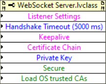
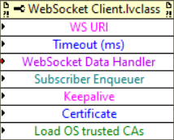

# WebSocket Actor

## Authors
Documentation: Andrea Vaccaro - David Grollier
Code: Andrea Vaccaro

# Description

A library implementing a high-level actor-based WebSocket communication. An actor can subscribe to a WebSocket Actor (either server or client) to facilitate WebSocket-based communication.

## Main Features

* Fully Actor Framework Based
* Full WebSocket Compatibility
* Support for WebSocket resources
* Keepalive infrastructure
* Secure connection capabilities

## Example Code

Look in the example folder for a comprehensive set of code examples covering the full functionality of the library.

## Note About Terminology

Please note that within this library **"resource names"**, as defined in
the WebSocket protocol specification, are referred to as **"services"**.

# Library

# Actors

## WebSocket Client.lvclass

It forwards packets received from the connected WebSocket Service to its subscriber as "WebSocket Connection Handler Msg" messages. It allows its subscriber to send data to a specified service to which the WebSocket
client is connected ("Send to Peer Msg" message" message of the parent "WebSocket Connection" class). Before starting the actor, the subscriber must provide, by means of suitable properties, a data handler message in
form of a concrete implementation of the "WebSocket Connection Handler Msg" abstract message used to handle the connection events corresponding to the WebSocket communication, a concrete implementation of the
"WebSocket Server-Service Enqueuer Msg" abstract message used to receive the WebSocket service actor enqueuer, and the WebSocket service URI to which the client should connect.

## WebSocket Server Manager.lvclass

This actor's role is solely that of launching and managing the stop of "WebSocket Server" actors listening on at a specific port and interface address ("Launch Server Msg" and "Stop Server Msg" messages). The actor
will ensure that the launched "WebSocket Server" actor doesn’t conflict on interface and port resources. If the server is already running at that port or on the specified interface the method sends just the server
enqueuer to the client. If the server is not running it will be launched.

## WebSocket Server.lvclass

Defines a WebSocket Server characterized by an interface and a port on which it listens. Allows for the definition of WebSocket Services. Services can be defined by the server subscriber by sending the "Add
Service" message to the actor. The subscriber must provide a concrete implementation of the "WebSocket Server-Service Enqueuer Msg" abstract message used to let its subscriber receive the WebSocket service actor
enqueuer and a data handler message in form of a concrete implementation of the "WebSocket Connection Handler Msg" abstract message used to handle the connection events corresponding to the WebSocket communication. For each service defined a "WebSocket Service" actor is started that will send data to the subscriber that has defined the service. The actor listens according to the server specifications on a port and on an interface if not all, when a connection is established, the actor performs the WebSocket handshake. If the service requested is defined in this server, it informs the WebSocket service Actor who will start a corresponding WebSocket connection actor. If either the service is not defined, or the handshake fails, we do nothing, the WebSocket protocol will take care of communicating the failure to the client.

## WebSocket Service.lvclass

It forwards packets received from the connected "WebSocket Client" actors to its subscriber actor as "WebSocket Connection Handler Msg" messages. It allows the subscriber to send data to a specified client ("Send to Peer Msg" message of the parent "WebSocket Connection" class) or to all connected clients (“Broadcast Msg” message). When launching the actor by means of the “WebSocket Server.lvclass” actor, the subscriber must provide a data handler message in form of a concrete implementation of the "WebSocket Connection Handler Msg" abstract message used to handle the connection events corresponding to the WebSocket communication and a concrete implementation of the "WebSocket Server-Service Enqueuer Msg" abstract message used to let the server subscriber actor receive the WebSocket service actor enqueuer.

## Abstract messages

Two abstract messages must be subclassed to allow the interaction of either a "WebSocket Server", a "WebSocket Service" or a "WebSocket Client" actor with the corresponding subscriber actor.

### WebSocket Connection Handler Msg.lvclass

This abstract message is sent by either the "WebSocket Client" or by the
WebSocket Service to the subscriber Actor on four events:

-   Connect
-   Disconnect
-   Message
-   Drop

For each subscriber Actor a concrete subclass of the message should be created by overriding the methods:

-   "On Connect.vi"
-   "On Disconnect.vi"
-   "On Message.vi"
-   "On Drop.vi"

The subscriber actor can program the required action for the corresponding event.

### WebSocket Server-Service Enqueuer Msg.lvclass

This abstract message is used either by the **WebSocket Server Manager** actor or by the **WebSocket Server** actor to send the just launched/added Server/Service Enqueuer to the subscriber actor requesting the operation. Each subscriber actor requesting the operation should subclass this message and then override the Do.vi wherein the Server/Service Enqueuer can be read from the suitable abstract message property and stored in the subscriber actor.

## Errors
All custom error generated by this library are forwarded to the appropriate subscriber actor to be handled by the "Handle Error" method. If such method is not overridden by the subscriber actor, the actor will stop when the subscribed actor generates an errors. All the errors generated the connection level will result 

The custom errors defined by this library are the following:

### 512000: The WebSocket connection dropped for unknown reasons.

This error is generated when the connection is dropped for an unknown reason most likely related to problems with the TCP/IP connection. In such cases a "Drop" type "WebSocket Connection Handler Msg" concrete message will be fired, allowing the subscriber (either a to a "WebSocket Client" actor or TO a "WebSocket Service" actor) to react to this situation by overriding the Drop method within the message concrete implementation.  Please note that if the Keepalive system is activated and a peer doesn't reply within the specified timeout, no error is generated. Rather, only the "Drop" type message is fired.

### 512001: The WebSocket Server could not establish a connection to the peer for unknown reasons.

This error is generated by the "WebSocket Server" actor when it is not able to establish a connection to the WebSocket client. In such cases the is presumed that the "WebSocket Server" actor is still able to establish new connections if requested.

### 512002: The WebSocket Server listener could not be created. Server is going to stop.
This is generated upon a "WebSocket Server" actor launch in case a TCP/IP listener cannot be created. In such case the "WebSocket Server" actor will stop.

### 512003: The WebSocket Server listener became invalid for unknown reasons. The WebSocket Server is not accepting the definition of any new server.

This is generated within the lifetime of a "WebSocket Server" actor when the TCP/IP listener becomes invalid. In such case the "WebSocket Server" actor will not stop, but will not be accepting the addition of any new services from the subscriber.

### 512004: The WebSocket Server is not accepting the definition of any new service.
In case one tries to add a service to a "WebSocket Server" actor that stopped accepting the addition of new services (see Error 512003) the subscriber demanding an addition will receive this error.

# API

## WebSocket Server Manager

### Keepalive Settings

The Keepalive settings allow for the configuration of the Keepalive functionality whereby client/server checks if the peer is still responding ("Alive") by sending WebSockets Ping messages to the peer on a certain time interval. The peer will answer with a WebSockets Pong message. If the answer is not received within a certain amount timeout the client/server will drop the connection.

**Enable** If true enables the Keepalive functionality
**Ping Interval (ms)** is the interval of time in milliseconds that elapses between the receipt of the previous pong response and the sending of the next ping message
**Ping Timeout (ms)** is the interval of time in milliseconds that a client/server waits after sending a ping message until declaring the peer not Alive and dropping the connection

### WebSocket Server Manager Configuration
Before launch the "Server Manager Actor" can be configured with the Keepalive settings described above by means of the following property node

**Keepalive** The Keepalive settings will be active for all the WebSocket Servers launched by the "WebSocket Server Manager" actor

**Certificate Chain** specifies an array of Distinguished Encoding Rules (DER) certificates. The certificates must be supplied depth-first: the server's certificate, followed by the Certificate Authority (CA) that signs the certificate of the server, on up to the root CA. For more details see LabVIEW TLS examples. 

**Private Key** a byte array containing the private key of the servers started by the server manager. For more details see LabVIEW TLS examples. 

**Secure** If set to TRUE all server started by the server manager will be providing only secure connections. In this case you will need to suitably configure at least the following parameters: **Certificate Chain**, **Private Key**.

**Load OS trusted CAs** specifies whether to load Certificate Authority (CA) certificates trusted by the OS for the secure connection.

### WebSocket Server Listener Settings

**timeout ms** specifies the time, in milliseconds, that the function waits for a connection. If a connection is not established in the specified time, the function returns an error. The default value is –1,
which indicates to wait indefinitely. 

**resolve remote address** indicates whether to call the IP To String function on the remote address.

**net address** specifies on which network address to listen. Specifying an address is useful if you have more than one network card, such as two Ethernet cards, and want to listen only on the card with the specified address. If you do not specify a network address, LabVIEW listens on all network addresses.

**port** is the port number on which you want to listen for a connection.

### Launch Server

**Message Enqueuer in** specifies the enqueuer of the WebSocket Server Manager actor.

**Listener Settings** specifies the listener settings for the Server.

**Handshake timeout** specifies the timeout of the handshake when the client establishes a WebSocket connection to the server.

**Receive Server Enqueuer Handler** specifies the concrete message (to be created) child of the abstract message “*WebSocket Server-Service Enqueuer Msg.lvclass*”.

### Stop a Server

**Subscriber Enqueuer** specifies the enqueuer of the actor that has subscribed to the previously launched "WebSocket Server" actor.

**Message Enqueuer in** specifies the enqueuer of the "WebSocket Server Manager" actor to be stopped.

**Listener Settings** specifies the listener settings for the previously launched "WebSocket Server" actor.

**Handshake timeout** specifies the timeout of the handshake when the client establishes a WebSocket connection to the server.

**Receive Server Enqueuer Handler** specifies the concrete message (to be created) child of the abstract message “*WebSocket Server-Service Enqueuer Msg.lvclass*”.

## WebSocket Server

In case the "WebSocket Server" actor is manually launched the following properties are available to configure it (the port must be entered) before its launch

**Listener Settings** specifies the Listener settings for the Server (see definition above).

**Handshake timeout** specifies the timeout of the handshake when the client establishes a WebSocket connection to the server.

**Keepalive** specifies the Keepalive settings for the Server (see definition above).

**Certificate Chain** specifies an array of Distinguished Encoding Rules (DER) certificates. The certificates must be supplied depth-first: the server's certificate, followed by the Certificate Authority (CA) that signs the certificate of the server, on up to the root CA. For more details see LabVIEW TLS examples. 

**Private Key** a byte array containing the server private key. For more details see LabVIEW TLS examples. 

**Secure** If set to TRUE the server will be providing only secure connections. In this case you will need to suitably configure at least the following parameters: **Certificate Chain**, **Private Key**.

**Load OS trusted CAs** For secure connections specifies whether to load Certificate Authority (CA) certificates trusted by the OS for the secure connection.

### Add Service

**Receive Connection Enqueuer** specifies the concrete message (to be created) child of the abstract message “*WebSocket Server-Service Enqueuer Msg.lvclass”.*

**Message Enqueuer in** specifies the enqueuer of the "WebSocket Server" actor.

**Service Name** specifies the name of the service.

**Subscriber Enqueuer** specifies the enqueuer of the actor that subscribes to the "WebSocket Server" actor.

**WebSocket Data Handler** specifies the concrete message (to be created) child of the abstract message “*WebSocket Connection Handler Msg.lvclass”.*

## WebSocket Service

### Broadcast

  
**Message Enqueuer in** specifies the enqueuer of the WebSocket Service actor.

**Data** specifies the data to be sent.

### Send

**Message Enqueuer in** specifies the enqueuer of the WebSocket Service actor.

**Data** specifies the data to be sent.

**Client ID** ID that identifies the specific WebSocket client to which we want to send the data

## WebSocket Client 

The following properties of the "WebSocket Client" actor must be set before launching it:

**WS URI** specifies the URI of the client with the following format:

**plain connections**: *ws://hostname:port/service*

**secure connections**: *wss://hostname:port/service*

for secure connections one has to configure the **Certificate** and **Load OS trusted CAs**, see below for description of these parameters.

**Timeout (ms)** is the timeout to establish the connection to the server. A value of –1 indicates to wait indefinitely.

**WebSocket Data Handler** specifies the concrete message (to be created) child of the abstract message “*WebSocket Connection Handler Msg.lvclass”.*

**Subscriber Enqueuer** specifies the enqueuer of the actor (must be created) that subscribes to the "WebSocket Client" actor.

**Keepalive** specifies the Keepalive settings for the Client (see definition above).

**Certificate** Certificate Authority (CA) certificate input as a byte array. For more details see LabVIEW TLS examples. 

**Load OS trusted CAs** For secure connections specifies whether to load Certificate Authority (CA) certificates trusted by the OS for the secure connection.

## Send to Peers

**Message Enqueuer in** specifies the enqueuer of the WebSocket Client actor.

**Data Format (Text)** Specifies an Enum allowing to specify if the data format is either “Text” or “Binary”.

**Timeout ms (5000)** is the timeout to establish the connection to the server. A value of –1 indicates to wait indefinitely.

## Abstract Messages
Abstract messages have private properties that carry useful information to be used when the subscriber actor implementing the Do.vi method ("WebSocket Server-Service Enqueuer Msg" message) or the "On Close.vi", "On Connect.vi", "On Message.vi", "On Drop.vi" ("WebSocket Connection Handler Msg" message) to act on the subscriber actor

### WebSocket Server-Service Enqueuer Msg

**Error** Carries the error resulting from either launching a server, or adding a service to a server or connecting to a client

**Service Name** String detailing the name of the service corresponding to the service that is being started and to which we are subscribing

**WebSocket Server-Service Enqueuer** the enqueuer of the server/service that was just started and to which we are subscribing

### WebSocket Connection Handler Msg

**Client/Service Enqueuer** The enqueuer of the Client/Service to which we subscribed that triggered the event

**Connection Event** Enum specifying the type of event being triggered. Can take values "On Connect", "On Message", "On Close", and "On Drop"

**Data** String containing the data being received if the event triggered is of type "On Message"

**Data Format** Enum specifying the type of data being received in case of a "On Message" event. It can take values "Binary" and "Text"

**Peer ID** String specifying the Peer ID from which the event is being triggered if the event is originating from a client

**Service Name** String specifying the service name from which the event is being triggered